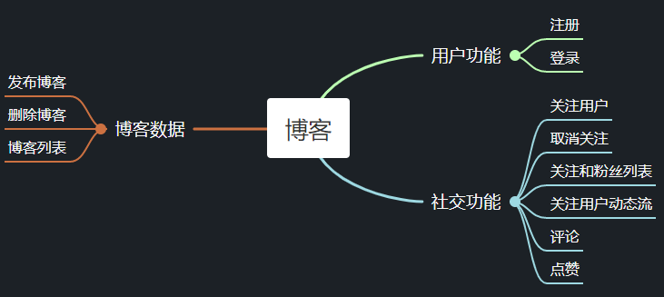

# pcblog 项目

Table of Content

## Introduce

这个项目是基于 Go 语言实现的简易的博客网站后端的实现。实现了用户注册、登录、发表文章、用户评论、点赞关注列表、基于写扩散的关注用户动态流等接口。

主要技术架构：gorm + Go 官方库 net/rpc

## 目录结构

```
│  blog.sql // 创建数据库的 SQL 语句
│  go.mod
│  go.sum
│  README.md
│
├─blog // 博客服务端的接口和实现
│      blog.go // 博客功能使用的结构体
│      like.go // 点赞接口
│      login.go // 登录接口和实现
│      newArticle.go // 发表文章接口和实现
│      register.go // 注册接口和实现
│      service.go // 博客功能对象接口
│      subscribe.go // 订阅功能接口和实现
│
├─client
│      client.go // 客户端代码
│
├─database // 数据库功能和实现
│      article.go // 文章发布的实现
│      cryption.go // 加密实现
│      database.go // 数据库结构体定义
│      follower.go // 用户粉丝列表的实现
│      inbox.go // 写扩散推送文章的实现
│      like.go // 点赞实现
│      subscriber.go // 用户关注他人的实现
│      user.go // 用户注册登录的实现
│
└─server
       server.go // 服务端代码
```

## 功能简图

